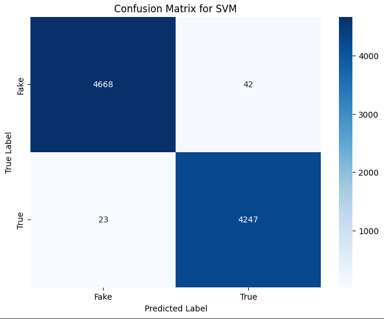

# 📰 Fake News Detection using NLP and Machine Learning


This project is part of Task 3 of the Elevvo Internship.
It applies Natural Language Processing (NLP) techniques to classify news articles as either Fake or True using supervised machine learning models.


## 🚀 Project Overview


- Goal: Detect whether a given news article is fake or real
- Dataset: (fake-and-real-news-dataset)
- Approach: 
    - Load and label Fake/True news articles
    - Preprocess and clean the text (lowercasing, lemmatization, stopword removal, etc.)
    - Convert text to TF-IDF vectors
    - Train multiple classifiers (Logistic Regression, SVM)
    - Visualize performance using Confusion Matrix and Word Clouds
    - Deploy interactive demo using Streamlit
- Tools & Libraries: 
    - NLTK, Scikit-learn, Pandas, Matplotlib, Seaborn, WordCloud, Streamlit


---

## 📁 Dataset


The dataset consists of two CSV files: `Fake.csv` and `True.csv`.

Since the full dataset and notebook exceed GitHub's size limits, you can access them from:
🔗 Google Drive: [My Drive](https://drive.google.com/drive/folders/1PBJ-cQ27l7konrQNcDhqOTwwVStcLJNb?usp=drive_link)

Or directly from:
🔗 Kaggle: 
[fake-and-real-news-dataset](https://www.kaggle.com/datasets/clmentbisaillon/fake-and-real-news-dataset?select=Fake.csv)


## 🧠 Models and Results


Two models were trained and evaluated:

1. Logistic Regression
   - Accuracy: 0.98
   - Classification Report:
     - Fake: Precision = 0.99, Recall = 0.98, F1 = 0.98
     - True: Precision = 0.98, Recall = 0.99, F1 = 0.98

2. Support Vector Machine (SVM)
   - Accuracy: 0.99
   - Classification Report:
     - Fake: Precision = 1.00, Recall = 0.99, F1 = 0.99
     - True: Precision = 0.99, Recall = 0.99, F1 = 0.99


## 📊 Visualizations


Confusion Matrices for both models and Word Cloud showing most frequent terms in Fake vs. True news:

- Logistic Regression Confusion Matrix
- SVM Confusion Matrix
- Word Cloud (fake and real terms highlighted visually)

Images are stored in the `images/` directory.


  
  


## 💾 Saved Files

The following files are saved for deployment and reuse:

- svm_model.pkl: Trained SVM model
- tfidf_vectorizer.pkl: TF-IDF vectorizer used during training


## 🧪 Streamlit App


An interactive app was created using Streamlit to test news text input:

To run it locally:
1. Install requirements:
   pip install streamlit joblib scikit-learn nltk

2. Run the app:
   streamlit run Fake_News_Detection_GUI.py


```markdown

## 🗂️ Project Structure

```
.
├── Fake_News_Detection_GUI.py        # Streamlit app
├── Fake_News_Classifier.ipynb        # Notebook with full training pipeline
├── svm_model.pkl                     # Trained SVM model
├── tfidf_vectorizer.pkl              # Trained TF-IDF vectorizer
├── /images
│   ├── Logistic Regression.png
│   ├── SVM.png
│   └── word cloud.png
└── README.md                         # Project documentation

```


## ✍️ Author


Mostafa Abbas Saleh  
AI Student | NLP Practitioner


## 🙏 Acknowledgment


Thanks to Elevvo for the valuable internship experience and training.

